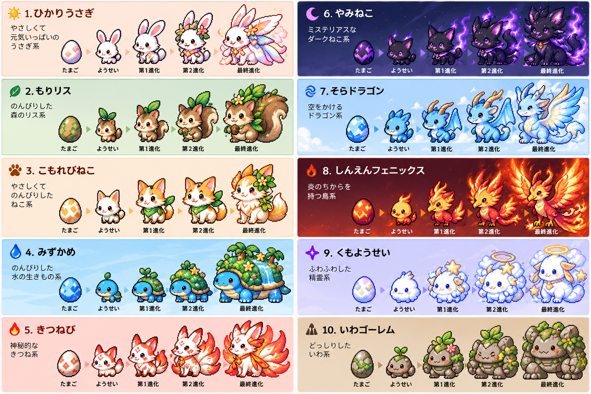

# キャラクター育成仕様

2026-10-04の合意を基に、2026-10-10の依頼で日付条件を約半分（4・7・11日目）に短縮した育成仕様。
本書は今後の実装・変更の基準であり、機能の実装完了を示すものではない。

## コンセプトと基本ループ

子どもがお手伝いをすることでキャラクターが育つ。1日1〜2回のお手伝いを想定する。最終進化の日付条件は11日目以降だが、必要な230ptが貯まるまでは育成を続ける。同じ生活・同じお手伝いのルーティンでも、毎回違う姿になる楽しさを重視する。

お手伝い完了 → 成長ポイント獲得 → 成長・進化 → 最終進化 → 図鑑登録 → 新しいタマゴで次の育成、の流れとする。既存アプリへの統合時は、下記「既存機能との統合」に従い、親の承認によって完了を確定する。

## 成長ポイントと進化条件

お手伝い1回につき基本10成長ポイント。必要ポイントは育成サイクル開始からの累計であり、進化のたびに消費・リセットしない。

| 段階 | 日数条件 | ポイント・行動条件 |
| --- | --- | --- |
| タマゴから孵化 | 初回のお手伝い時 | 初回のお手伝い完了 |
| 第1進化 | Day 4以降 | 累計80pt以上 |
| 第2進化 | Day 7以降 | 累計150pt以上 |
| 最終進化 | Day 11以降 | 累計230pt以上 |

- 各進化は日数と累計ポイントの両方を満たした時点で可能になる。ポイントだけで日数条件を早めない。
- 11日は期限ではない。Day 11で230pt未満でも失敗にせず、Day 12以降も育成を続け、条件を満たせば最終進化する。
- 日付条件だけを短縮し、80・150・230ptの条件は維持する。1日1回なら23回分で23日、1日2回なら12日が最終進化の目安。既存の開始日・ポイント・確定済み進化・図鑑は保持し、次の通常の進化判定から新条件を使う。
- 連続ログイン・連続お手伝いを育成の必須条件にしない。休んだことによる減点、弱体化、退化、進化確率低下は設けない。2026-10-05の追加合意により、交換用ポイントの連続お手伝いボーナスは1日休みまで維持し、2日連続で休むと新しい連続記録になる。累計・最高記録・獲得済みポイントは保持する。詳細は `CHORE_STATS.md` を参照。

## ランダムな進化ツリー

「お手伝い = 成長」「キャラクターの種類 = ランダム進化」を基本設計とする。第1進化、第2進化、最終進化でそれぞれランダムに分岐し、現在の系統によって次の進化候補が変わる。特定のお手伝い内容・アイテム・生活パターンだけで進化先を確定させない。

将来、以下の確率補正を追加できる構造にする。具体的な重みや連続回数は未確定であり、今回の合意として数値を固定しない。

- 未取得キャラクターを出やすくする。
- 取得済みキャラクターは通常の確率とする。
- 直前に育てた最終キャラクターを出にくくする。
- 同じキャラクターの連続を抑える。
- 被りが続いた場合、未取得キャラクターの確率を徐々に上げる。

候補は現在の進化ツリーの範囲内から選ぶ。詳細な確率・分岐条件や進化結果を子どもへ事前に表示せず、「どんな姿になるかは育ってからのお楽しみ」とする。

性格システム、特定のお手伝いを条件にする秘密進化、アイテム選択で進化先が確定する方式は採用しない。以前の30日サイクルやDay 3・30ptでの孵化案ではなく、本書の4・7・11日目の条件・初回孵化を基準とする。

## キャラクターデザイン方針

基本スプライトサイズは **48×48px**。昔のたまごっちほど荒いドットではなく、少し精細な現代的ピクセルアートにする。

- 2〜2.5頭身程度、丸みのあるシルエット、表情が分かる目。
- 基本は3〜5色程度＋陰影。毛、羽、角、模様などで個性を出す。
- 進化するほど48×48px内で占める面積を大きくする。
- 単なる色違いではなく、進化ごとにシルエットを変える。
- アプリ表示は整数倍拡大＋補間なしを基本とする。
- 将来的に待機・喜ぶ・ジャンプ・寝る・進化などのスプライトアニメーションを追加できるよう、キャラクター・成長段階・動作ごとの素材定義を分けられる構造にする。フレーム数や速度は未確定。

### 初期キャラクター候補

以下の10系統を初期案とする。各段階の具体的な絵や分岐の接続先は別途定義し、初期候補と確定した進化ツリーを混同しない。

1. ひかりうさぎ
2. もりリス
3. こもれびねこ
4. みずかめ
5. きつねび
6. やみねこ
7. そらドラゴン
8. しんえんフェニックス
9. くもようせい
10. いわゴーレム

「みずかめ」は最終進化でも四足であることが明確なデザインにする。

### かっこいい系

10系統すべてを幼児向けの可愛いデザインにはしない。次の3系統は特に「かっこいい」方向にする。ただし怖すぎず、小学生が「相棒にしたい」と思える範囲にする。

| 系統 | 色・特徴 | 最終進化の方向 |
| --- | --- | --- |
| やみねこ | 黒〜濃紫。紫の炎やオーラ、鋭い耳や尻尾 | ミステリアスで強そうなデザイン |
| そらドラゴン | 青〜白。角、翼、長い尻尾 | 大きな翼を持った堂々としたドラゴン |
| しんえんフェニックス | 赤〜橙〜金。進化するほど炎と翼が大きくなる | 翼を大きく広げた迫力のある姿 |

## ビジュアルリファレンス

キャラクター進化のコンセプトアート：`docs/assets/character-concept.png`

この画像はキャラクターデザインの方向性を示すリファレンスであり、ゲーム内で使用する最終48×48スプライトそのものではない。

実際のスプライト制作時は、この画像の以下の要素を参考にする。

- 48×48程度で表現可能なピクセルアート。
- 幼体から最終進化まで、シルエットが明確に成長する。
- 基本はかわいさを残す。
- 「やみねこ」「そらドラゴン」「しんえんフェニックス」は、他のキャラクターよりかっこよさ・迫力を強くする。
- 「みずかめ」の最終形態は四足を明確にする。
- 進化を単なる色違いにしない。
- 最終進化は子どもが「これ欲しい！」と思える特別感を出す。

## 体験・演出

- お手伝い完了時は「+10」だけでなく、キャラクターが喜ぶ・ジャンプするなどのリアクションを追加できる構造にする。
- 進化可能になったら「なんだか様子が違う……」などの予兆を表示して進化演出へ移る。
- 最終進化は通常進化より豪華な演出を想定する。
- 子ども向け画面では技術用語を避け、完了報告の確認待ちと成長の確定を区別する。

## 図鑑と育成履歴

最終進化したキャラクターを図鑑へ登録する。最低限、次の情報を保存できるデータモデルにする。

| 項目 | 内容 |
| --- | --- |
| キャラクターID | 最終形態の識別子 |
| キャラクター名 | 登録したキャラクターの名前 |
| 最終進化日 | 最終進化した日 |
| 育成開始日 | その育成サイクルの開始日 |
| 育成にかかった日数 | 開始から最終進化までの日数 |
| お手伝い回数 | その育成期間中に完了した回数 |

同じ種類を再度育てても以前の記録を上書きしない。種類を表すキャラクターIDと、1回の育成を識別するIDを分けるなど、個体・サイクルごとの履歴を保持できる設計にする。

育成中のデータには、開始日時、現在の段階・キャラクター、累計成長ポイント、お手伝い回数、確定済みの進化結果を保存できるようにする。具体的なフィールド名・保存場所は既存構成を調査して決める。

## 次の育成と将来の拡張

最終進化後は図鑑・育成履歴を残したまま、新しいタマゴから次のサイクルを開始できるようにする。過去のキャラクターを消さない。

2026-10-06の追加依頼により、「みんなの庭」を実装する。最終進化した仲間が散歩し、拾ってきた家具を配置できる。庭の具体的な仕様・権限・初版の上限は [GARDEN.md](GARDEN.md) を参照。育成条件やランダム進化は変更しない。

## 既存機能との統合

以下は既存コードを確認したうえでの統合要件である。既存の承認制・ポイント整合性・アクセス制御を維持する。

### 現在の構成

- フレームワークなしのHTML/CSS/JavaScriptとFirebase Auth・Firestoreを利用したPWA。
- `dist/app.js`：画面、完了・交換申請、親の承認、Firestoreトランザクション、子どもの端末変更処理。
- `dist/domain.mjs`：初期状態、日付キー、承認時のポイント計算と二重加算防止。
- `families/{parentUid}`：chores、rewards、accounts、history。members、joins、requestsはそのサブコレクション。
- `firestore.rules`：家族・役割ごとのアクセス制御。
- `tests/domain.test.mjs`、`tests/rules.test.mjs`：ドメイン処理・アクセス制御の検証。

### 守ること

- 子どもの「できた！」送信だけでは成長ポイントを確定せず、親がお手伝い申請を承認したときに1回分を付与する。未承認・見送り・ご褒美交換では付与しない。
- 成長ポイントは、親が設定するご褒美交換用ポイント残高と別に管理する。お手伝いの交換用ポイント額にかかわらず基本10ptとし、ご褒美交換で成長ポイントを減らさない。
- 既存の申請承認・残高更新のトランザクションと整合させ、再送・再承認・競合による成長ポイントの二重付与を防ぐ。既存の日本時間で同じお手伝いは1日1回という制約を保つ。
- 再読み込みやトランザクションの再試行で確定済みの進化結果が変わったり、図鑑へ重複登録されたりしない設計にする。
- 子どもから親への権限昇格、家族外アクセス、成長ポイント・進化結果の不正な直接書き換えを防ぐ。画面の制限だけで済ませない。
- 既存データに育成項目がなくても読み込めるようにし、端末変更でも育成データと履歴を引き継げる設計にする。
- 本番データはFirestoreに保持し、localStorage・メモリで代替しない。おためしモードは本番と区別する。
- 過去の育成履歴が増え続けるため、現状の単一家族ドキュメントへ無制限に詰め込まず、保存先・分割方針を検討する。

## 実装の進め方

実装前にREADME.md、PROJECT_CONTEXT.md、AGENTS.md、既存コードを確認し、短い実装計画を提示する。以下の順で、小さく統合する。

1. 育成データモデル
2. 成長ポイント処理
3. 日数・累計ポイントによる進化判定
4. ランダム進化ロジック
5. 図鑑・育成履歴
6. 最低限の育成画面と演出の接続
7. 必要なテスト

初期10系統の候補とデザイン方針は上記を基準とする。各段階の正式名称・イラスト・最終的な進化ツリーは未確定。定義データと処理を分け、後から追加・変更しやすくする。既存の指示・機能は維持し、この仕様書の追加だけでアプリの挙動や公開先を変更しない。

## 実装前に決める詳細

以下は会話で確定していないため、合意済みの数値と混同しない。実装計画で扱いを明示する。

- Day 1の起点、日数の算出方法・タイムゾーン、遅れて承認されたお手伝いの日付の扱い。
- 条件を複数段階分満たしている場合の進化・演出の順番と、日付経過時の再判定タイミング。
- 日別の成長ポイント上限・追加ボーナスの有無。1日1〜2回は想定ペースであり、2回の上限が確定したわけではない。
- 次のタマゴを開始する操作・タイミング、最終進化後の余剰ポイントの扱い。
- 導入前の完了履歴を遡って育成へ反映するかどうか。
- 進化候補、確率補正の数値、候補がすべて取得済みの場合の扱い。

## 実装時の検証観点

- 初回孵化、Day 4/7/11および80/150/230ptの境界で、日数・ポイントの片方だけでは進化しないこと。
- Day 11で不足しても続けられ、休んだ日によるペナルティがないこと。
- 各段階で系統に沿った候補が選ばれ、確定結果が再読み込みで変わらないこと。
- 二重承認・再試行・ご褒美交換で成長ポイントが誤って増減しないこと。
- 同種の複数育成、次のタマゴ、再読み込み、端末変更でも図鑑と過去の育成履歴が保持されること。
- 既存のお手伝い、交換、承認、残高不足チェック、家族ごとのアクセス制御が維持されること。

変更に応じて `npm test` を実行し、アクセス制御を変更した場合はFirebaseエミュレーターのルールテストも実施する。家族の実データを試験に使わない。

### 輪郭の表示補正（2026-10-10）

48×48へ変換後、全20スプライト・各3コマの外周を基本1ドット幅にそろえる。外周につながる太い暗色部分は内側2ドットまで周辺色で補正し、離れた目・口は保持する。アトラス隣接セル由来の微小な孤立点は除去する。元の画像ファイルは保持し、描画時に適用する。細い部位や内側の模様まで一律に細線化する処理ではない。
